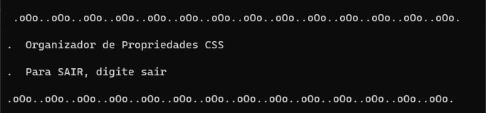
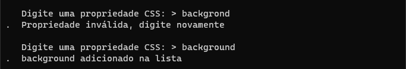
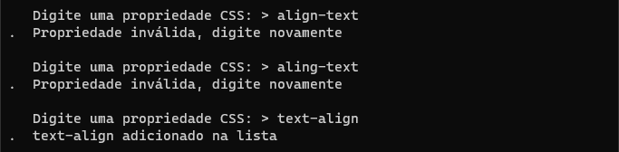
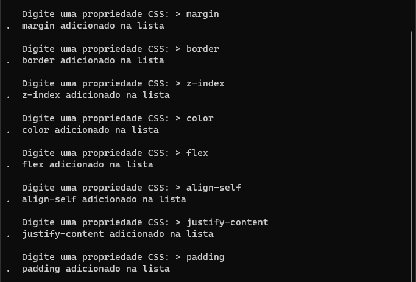
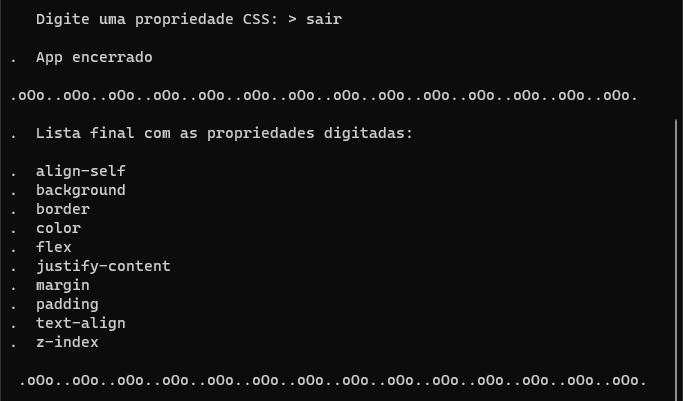

## <a href="#"></a> Projeto individual do módulo 4 - CDA 

**Contexto:** *Uma ferramenta que vai receber uma lista de propriedades de CSS (ex: background-color, font-size, text-align) e vai devolvê-la ordenada de A-Z.
Você deve utilizar o Node para criar o código responsável por implementar essa ferramenta na linha de comando.*

## 🛠️ Como instalar e rodar o App

 Tenha o Node.js instalado, caso ainda não tenha, faça o download no link abaixo: 

- [Download Node.js](https://nodejs.org/)

###  Windows

✔️ Testado no CMD e Powershell

Clone o repositório no terminal com o seguinte comando:

```
git clone https://github.com/julianebueno/projetoIndividual4-CDA.git
```

Entre na pasta onde estão os aquivos:

```
cd .\projetoIndividual4-CDA\
```
Instale os pacotes necessários para a ferramenta funcionar:
```
npm install prompt-sync
```
Rode o App:
```
npm start
```

## 🚀 Resultados

- Início com saudação e informações



- Mensagens de erro e acerto




- Recebimento de propriedades de forma aleatória



- Final com a apresentação da lista em ordem alfabética



## 📄 Referências / Inspirações

[Getting User Input in Node.js](https://www.codecademy.com/article/getting-user-input-in-node-js)

[JavaScript Array Reference](https://www.w3schools.com/jsref/jsref_obj_array.asp)

[ASCII Art Archive](https://www.asciiart.eu/art-and-design)
